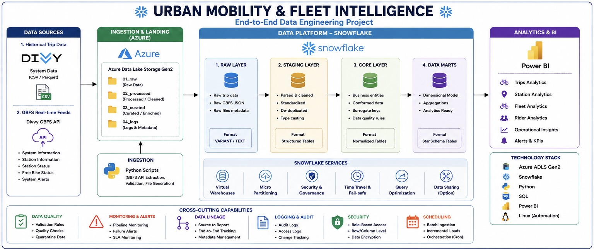

# 🚲 Urban Mobility & Fleet Intelligence

### ❄️ End-to-End Data Engineering Project

A cloud-based Data Engineering platform that transforms urban mobility data into trusted analytical datasets for **trip, station, fleet, and rider intelligence**.

**Azure ADLS Gen2 → Snowflake → Data Marts → Power BI**

---

## 🚀 What is this project?

This project builds an end-to-end data platform for urban mobility.

Historical trip data and GBFS mobility feeds are **ingested, processed, validated, transformed, and served through analytical data marts**.

The platform brings together:

**Azure ADLS Gen2 • Snowflake • Python • SQL • Linux • Power BI**

---

## ⚙️ Data Engineering

The project focuses on practical Data Engineering concepts:

- Batch & incremental ingestion
- Cloud data lake architecture
- Snowflake ELT pipelines
- JSON / semi-structured data processing
- Dimensional data modeling
- Data quality validation
- Data lineage
- Monitoring & error handling

---

## 🧰 Technology Stack

| Category | Technology |
|---|---|
| Cloud | Microsoft Azure |
| Storage | ADLS Gen2 |
| Data Warehouse | Snowflake |
| Processing | SQL / ELT |
| Programming | Python |
| Automation | Linux / Bash |
| BI | Power BI |
| Version Control | Git / GitHub |

---

## 📊 What can it answer?

🚲 **Trips** — demand, duration, peak periods  
📍 **Stations** — utilization, availability, demand  
🚴 **Fleet** — availability and operational trends  
👤 **Riders** — usage patterns and behavior

---

## 📚 Documentation

The complete engineering documentation is maintained in the [`docs/`](docs/) directory:

- [01 — Business Requirements](docs/01_Business_Requirements.md)
- [02 — Source & Data Dictionary](docs/02_Source_and_Data_Dictionary.md)
- [03 — HLD / Architecture](docs/03_HLD_Architecture.md)
- [04 — Data Flow Diagram](docs/04_Data_Flow_Diagram.md)
- [05 — Data Model / Star Schema](docs/05_Data_Model_Star_Schema.md)
- [06 — Source-to-Target Mapping](docs/06_Source_to_Target_Mapping.md)
- [07 — Pipeline / ETL Design](docs/07_Pipeline_ETL_Design.md)
- [08 — Data Quality & Validation](docs/08_Data_Quality_Validation.md)
- [09 — Data Lineage](docs/09_Data_Lineage.md)
- [10 — Monitoring & Error Handling](docs/10_Monitoring_Error_Handling.md)
- [11 — Deployment / Runbook](docs/11_Deployment_Runbook.md)
- [12 — Main Documentation README](docs/12_Main_README.md)

---

## 🚧 Project Status

**Currently under active development.**

The platform is being built incrementally from source ingestion through Snowflake transformation, validation, monitoring, and BI.

---

## 👨‍💻 Author

**Onkar Jadhav**  
Aspiring Data Engineer

**SQL • Snowflake • Azure • Python • Data Engineering**
